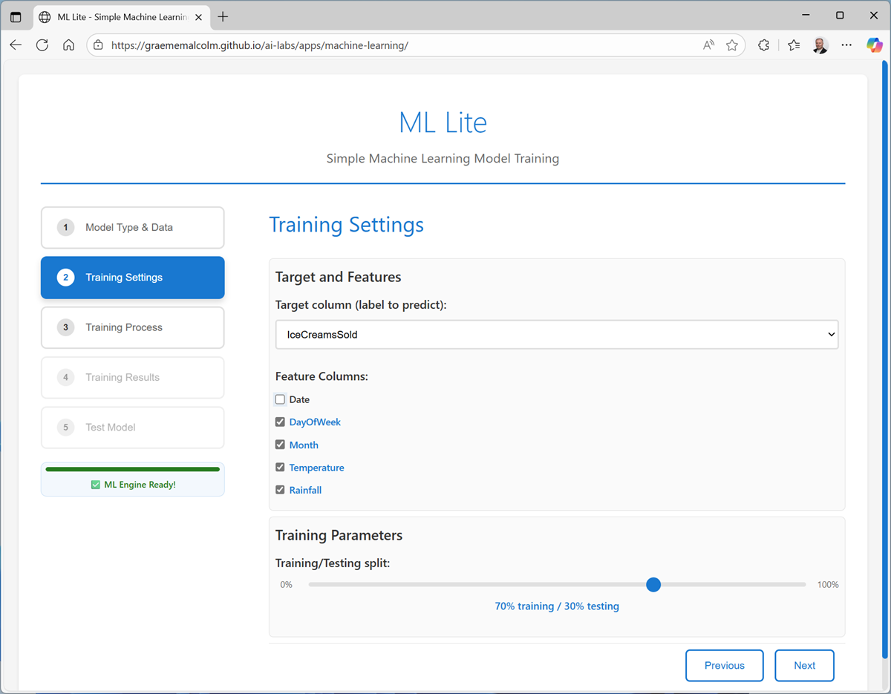

# Explore Machine Learning

In this exercise, you’ll use a lightweight application to train and evaluate machine learning models. You’ll then deploy and test the trained model.

This exercise should take approximately 15 minutes to complete.

## Download data

In this exercise, you’ll use data files to train multiple types of machine learning model.

1. Download [ml-data.zip](https://aka.ms/mslearn-ai-data) from [`https://aka.ms/mslearn-ai-data`](https://aka.ms/mslearn-ai-data) to your local computer.
1. Extract the downloaded archive in a local folder to see the files it contains. These files contain data suitable for training machine learning models.

## Train a regression model

Let’s start by training regression model, which predicts a numeric value. In this exercise, we’ll use a dataset of historic sales to predict demand for ice cream cones on a given day, based on seasonal and weather-related features.

1. In a browser, navigate to the [ML Lite](https://aka.ms/ml-lite) web application at [`https://aka.ms/ml-lite`](https://aka.ms/ml-lite), which you’ll use in this exercise.
1. Wait for the ML Engine to load and initialize (this can take a few seconds). When the ML Engine is ready, you can complete the pages in the  wizard to train and test a machine learning model.
1. On the **Model Type & Data page**, select **Regression** and upload the **ice-cream.csv** text file to see a preview of the data it contains.

4. On the Training Settings page:
  - Set the **Target column** to IceCreamsSold.
  - Deselect **Date** as a feature (it’s unique each day, so unlikely to be predictive on its own) and use the other remaining columns as features with which to train the model.
  - Review the **Training/Testing split** (which determines how much of the dataset to use for training the model, and how much to hold back for model evaluation).

5. On the **Training Process** page, review the settings and train the model. When the model is trained, you can save it on your local computer (to use in your own Python application) and view the training log and model details.

6. On the **Training Results** page, view the metrics and visualizations that were produced from the test data you held back. These metrics indicate how well the model predicted ice cream sales based on the features in the test data.

The visualization shows a comparison of the predicted numeric values and the actual numeric values in the test data. A model that predicts well should show a linear trend where the predictions and actual values correlate well.

7. On the **Test Model** page, use the default test data to generate a prediction.

![Screenshot of the Test Model page.])(./assets/img/05.png)

8. Try generating predictions with the following test cases:

| Feature | Case 1 | Case 2|
|---------|--------|-------|
| DayOfWeek| Friday | Monday |
| Month	| May | November
| Temperature | 72.3 | 55.8 |
| Rainfall| 0.01 | 0.56 |

## Train a classification model

Now let’s train a classification model to predict which of three species a penguin is (0: Adelie, 1: Gentoo, or 2: Chinstrap), based on its measurements.

1. If you’re still viewing the **Test Model** page for the ice cream regression model, use the **Train another model** to restart the wizard.
1. On the **Model Type & Data** page, select Classification** and upload the **penguins.csv** text file to see a preview of the data it contains.
1. On the **Training Settings** page:
  - Set the **Target column** to Species.
  - Use all remaining columns as features with which to train the model.
  - Review the **Training/Testing split** (which determines how much of the dataset to use for training the model, and how much to hold back for model evaluation).
1. On the **Training Process** page, review the settings and train the model.
1. On the **Training Results** page, view the metrics and visualizations that were produced from the test data you held back.

> The visualization shows a confusion matrix, comparing the number of correct and incorrect predictions for each class.

6. On the **Test Model** page, use the default test data to generate a prediction.

> The result will be a numeric class identifier that indicates the species (0: Adelie, 1: Gentoo, or 2: Chinstrap).

7. Try generating predictions with the following test cases:

| Feature | Case 1 | Case 2 |
|---------|--------|--------|
| CulmenLength | 45.2 | 46.9 |
| CulmenDepth | 15.4 | 16.7 |
| FlipperLength | 219 | 189 |
| BodyMass| 4753 | 3645 |

## Train a clustering model

Finally, let’s train a clustering model to separate customers into groups based on their spending habits. Specifically, we’ll consider their purchase frequency (how often they make a purchase), and their average spend per purchase.

1. If you’re still viewing the **Test Model** page for the penguin classification model, use the **Train another model** to restart the wizard.
1. On the **Model Type & Data** page, select **Clustering** and upload the **customers.csv** text file to see a preview of the data it contains.
1. On the **Training Settings** page:
  - Use *AverageSpend* and *AverageFrequency* as the feature columns.
  - Set the number of clusters to **Automatic** (so the training process tries to find the optimal number of clusters into which the data should be separated)
1. On the **Training Process** page, review the settings and train the model.
1. On the **Training Results** page, view the metrics and visualizations that were produced from the test data you held back.

> The visualization shows a scatter plot indicating the cluster separation (projected as two dimensions).

6. On the **Test Model** page, use the default test data to generate a prediction.
7. Try generating predictions with the following test cases:

| Feature | Case 1 | Case 2 |
|---------|--------|--------|
| AverageSpend | 21.0 | 46.9 |
| AverageFrequency | 105.0 | 2.0 |

## Summary

In this exercise, you trained three different kinds of machine learning model, reviewing relevant evaluation metrics for each model and using them to predict new values.

While the tool you used in this exercise is basic, it uses tried and tested algorithms and the Scikit-Learn framework for Python to train and evaluate machine learning models based on data. You can use it with your own data if you want to explore further.

In real-world, enterprise scenarios, a more scalable, cloud-based machine learning platform, such as Microsoft Azure Machine Learning, offers a comprehensive solution for training and managing machine learning models to power AI-informed decision making.

## References

- [Explore Machine Learning](https://microsoftlearning.github.io/mslearn-ai-concepts/Instructions/exercises/01-machine-learning.html)
