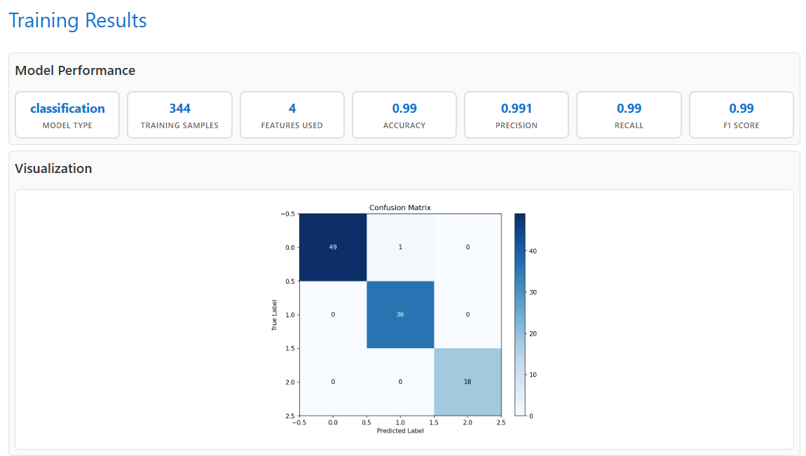

# Train a classification model

Now let’s train a classification model to predict which of three species a penguin is (0: Adelie, 1: Gentoo, or 2: Chinstrap), based on its measurements.

1. If you’re still viewing the **Test Model** page for the ice cream regression model, use the **Train another model** to restart the wizard.
1. On the **Model Type & Data** page, select Classification** and upload the **penguins.csv\*\* text file to see a preview of the data it contains.
1. On the **Training Settings** page:

- Set the **Target column** to Species.
- Use all remaining columns as features with which to train the model.
- Review the **Training/Testing split** (which determines how much of the dataset to use for training the model, and how much to hold back for model evaluation).

1. On the **Training Process** page, review the settings and train the model.
1. On the **Training Results** page, view the metrics and visualizations that were produced from the test data you held back.

> The visualization shows a confusion matrix, comparing the number of correct and incorrect predictions for each class.

6. On the **Test Model** page, use the default test data to generate a prediction.

> The result will be a numeric class identifier that indicates the species (0: Adelie, 1: Gentoo, or 2: Chinstrap).

7. Try generating predictions with the following test cases:

| Case    | CulmenLength | CulmenDepth | FlipperLength | BodyMass | Prediction |
| ------- | ------------ | ----------- | ------------- | -------- | ---------- |
| Default | 39.1         | 18.7        | 181           | 3750     | **0**      |
| Case 1  | 45.2         | 15.4        | 219           | 4753     | **1**      |
| Case 2  | 46.9         | 16.7        | 189           | 3645     | **2**      |
