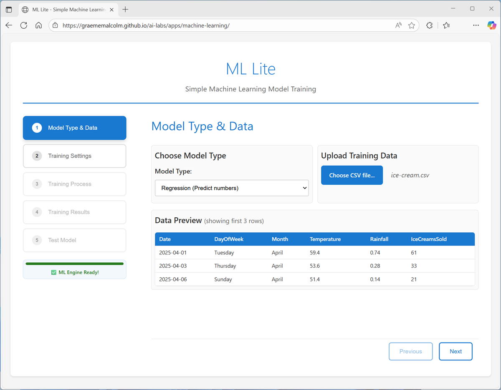
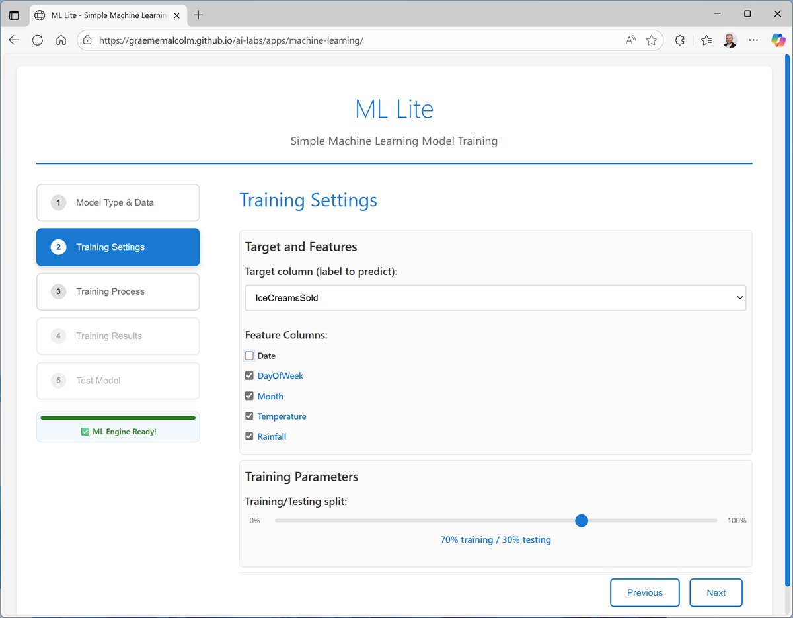
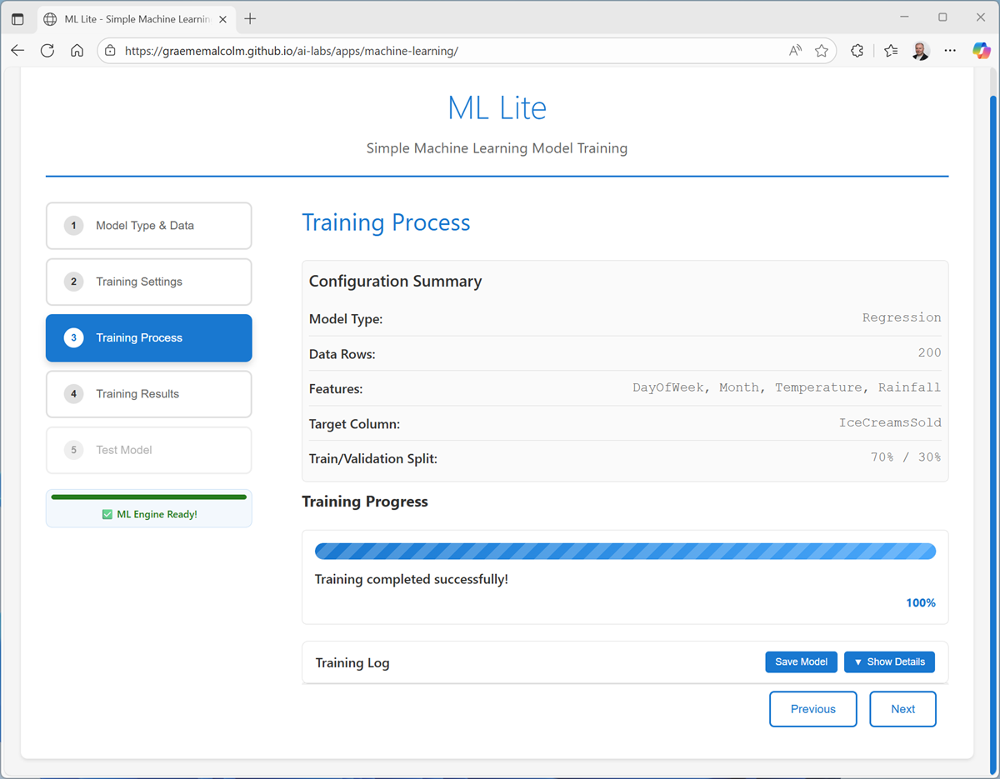
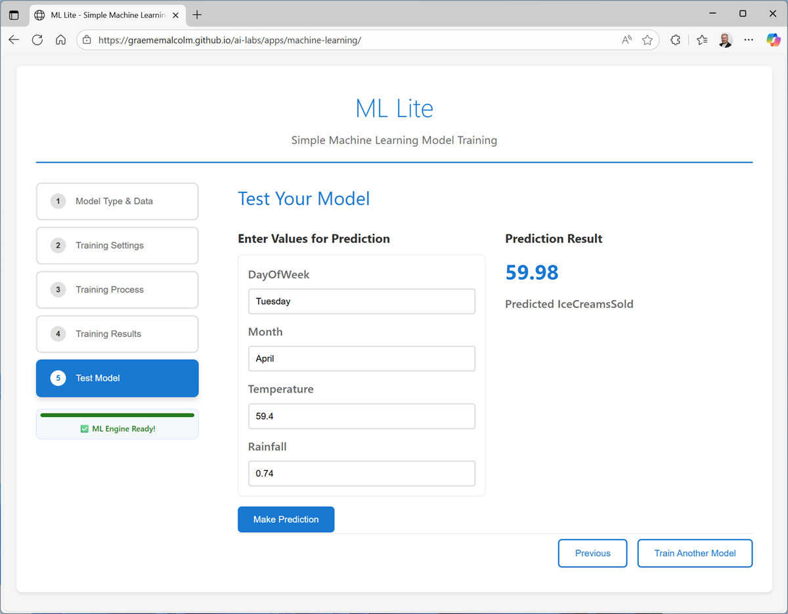

# Train a regression model

Let’s start by training regression model, which predicts a numeric value. In this exercise, we’ll use a dataset of historic sales to predict demand for ice cream cones on a given day, based on seasonal and weather-related features.

1. In a browser, navigate to the [ML Lite](https://aka.ms/ml-lite) web application at [`https://aka.ms/ml-lite`](https://aka.ms/ml-lite), which you’ll use in this exercise.
1. Wait for the ML Engine to load and initialize (this can take a few seconds). When the ML Engine is ready, you can complete the pages in the wizard to train and test a machine learning model.
1. On the **Model Type & Data page**, select **Regression** and upload the **ice-cream.csv** text file to see a preview of the data it contains.

4. On the Training Settings page:

- Set the **Target column** to IceCreamsSold.
- \_De_select **Date** as a feature (it’s unique each day, so unlikely to be predictive on its own) and use the other remaining columns as features with which to train the model.
- Review the **Training/Testing split** (which determines how much of the dataset to use for training the model, and how much to hold back for model evaluation).

5. On the **Training Process** page, review the settings and train the model. When the model is trained, you can save it on your local computer (to use in your own Python application) and view the training log and model details.

6. On the **Training Results** page, view the metrics and visualizations that were produced from the test data you held back. These metrics indicate how well the model predicted ice cream sales based on the features in the test data.

The visualization shows a comparison of the predicted numeric values and the actual numeric values in the test data. A model that predicts well should show a linear trend where the predictions and actual values correlate well.

7. On the **Test Model** page, use the default test data to generate a prediction.

8. Try generating predictions with the following test cases:

| Case    | Month    | DayOfWeek | Temperature | Rainfall | Prediction |
| ------- | -------- | --------- | ----------- | -------- | ---------- |
| Default | April    | Tuesday   | 59.4        | 0.74     | **59.98**  |
| Case 1  | May      | Friday    | 72.3        | 0.01     | **130.91** |
| Case 2  | November | Monday    | 55.8        | 0.56     | **43.44**  |
